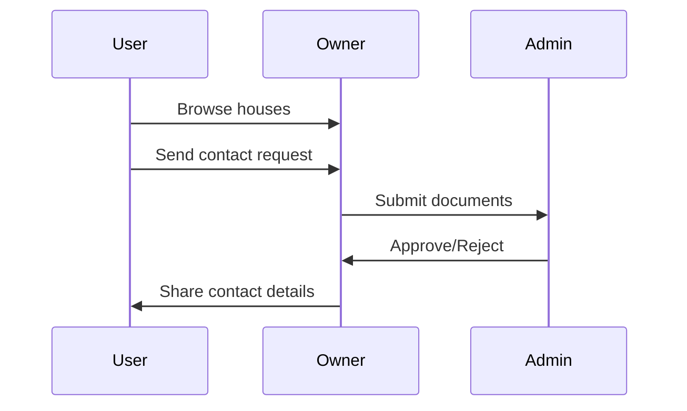

# <span style="font-size: 3em; font-weight: bold;">RentRadar 🏡</span>

**Your ultimate solution for seamless house rentals!**

<div style="display: flex; align-items: center; justify-content: space-between;">
  
</div>

---

## 🏠 Overview

RentRadar is a web application designed to streamline the house rental process. With dedicated sections for admins, owners, and users, it ensures a smooth and interactive experience for all stakeholders. Whether you want to list a house, browse rentals, or manage your rental data, RentRadar has got you covered.

---

## 🎯 Features

### Admin Panel
- Approve or deny owner registrations and documents.
- Manage user and owner details.
- Track house listings.

### Owner Portal
- Register and upload necessary documents for admin approval.
- List houses with detailed information and images.
- Manage house listings and view user requests.

### User Experience
- Browse houses with filters for state and city.
- Live search functionality for quick results.
- Contact owners through a request system.

---

## 🚀 Tech Stack

| Frontend  | Backend  | Database | Other Tools         |
|-----------|----------|----------|---------------------|
| HTML5     | PHP      | MySQL    | AJAX                |
| CSS3      | jQuery   |          | Bootstrap           |
| JavaScript|          |          |                    |

---

## 📂 Project Structure

```
RentRadar/
├── ajax/                   # AJAX scripts for dynamic updates
├── DataBase/               # DataBase Files
├── img/                    # store house upload images
├── ScreenShort/            # Website screenshot 
├── index.php               # Landing page
└── README.md               # Documentation
```

---

## 🖥️ Installation

1. **Clone the Repository**
   ```bash
   git clone https://github.com/KrupalPatel17/RentRadar.git
   ```

2. **Setup the Database**
   - Import the SQL file located in `sql/` into your MySQL database.

3. **Configure the Environment**
   - Update the database connection details in `config.php`.

4. **Start the Server**
   - Run the project using [XAMPP](https://www.apachefriends.org/) or any PHP server.

5. **Access the Application**
   - Open your browser and navigate to `http://localhost/RentRadar/`.

---

## 🎨 Live Demo (Optional Animation Section)



---

## 💻 Screenshots

### Landing Page


### Admin Dashboard


### Owner Portal


### User Side


---

## 🤝 Contributions

Contributions are welcome! Please follow these steps:
1. Fork the repository.
2. Create a new branch for your feature: `git checkout -b feature-name`
3. Commit your changes: `git commit -m 'Add some feature'`
4. Push to the branch: `git push origin feature-name`
5. Create a pull request.

---

## 🌟 Acknowledgments
- Inspired by real-world rental challenges.
- Developed with ❤️ by Krupal Patel.


---

## 📧 Contact
For any queries or support, feel free to reach out to me:
- **GitHub**: [Krupal Patel](https://github.com/KrupalPatel17)


